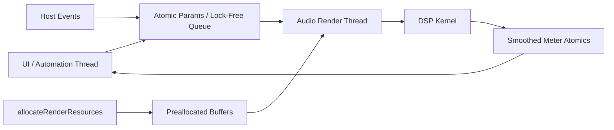

# DSP Real-Time Control

Use this skill when implementing or reviewing code that runs on an audio render thread.

## Render-thread rules
- No heap allocation.
- No locks.
- No file I/O.
- No logging.
- No waiting or semaphores.
- No UI or Objective-C runtime work in the callback.
- No API call whose latency is unknown.
- Allocate buffers in prepare or `allocateRenderResources`.
- Size buffers from host constraints such as `maximumFramesToRender`.

## Architecture model
Separate the control plane from the render plane:



## Control handoff
- Use atomics for simple scalar parameter values.
- Use lock-free queues or stamped event queues for scheduled automation.
- Use immutable snapshots for larger state changes.
- Be sample-accurate only where the ear cares.
- Use block-accurate or sub-block-accurate updates for lower-risk controls.
- Keep meters separate from audio behavior.

## Smoothing choices
| Smoothing method | Cost | Click risk | Good uses | Avoid for |
|---|---:|---:|---|---|
| Linear ramp | Low | Low for gain and mix | Gain, mix, crossfades | Fast resonant filter modulation |
| Exponential smoothing | Very low | Low | Frequency-like controls, detector motion | Exact time-aligned automation |
| Per-sample ramp | Medium to high | Very low | Host automation, pitch, modulation depth | Dense graphs on weak CPUs |
| Block-based ramp | Very low | Medium on large blocks | Broad UI motion, metering | Fast automation and transient-sensitive controls |

## Linear smoother
```cpp
struct LinearSmoother {
    float current = 0.0f;
    float target = 0.0f;
    float step = 0.0f;
    int samplesLeft = 0;

    void reset(float value) {
        current = target = value;
        step = 0.0f;
        samplesLeft = 0;
    }

    void setTarget(float newTarget, int rampSamples) {
        target = newTarget;
        samplesLeft = std::max(rampSamples, 1);
        step = (target - current) / static_cast<float>(samplesLeft);
    }

    float next() {
        if (samplesLeft > 0) {
            current += step;
            --samplesLeft;
            if (samplesLeft == 0) current = target;
        }
        return current;
    }
};
```

## Swift exponential smoother
```swift
struct OnePoleSmoother {
    private(set) var value: Float = 0
    private var alpha: Float = 1

    mutating func configure(timeSeconds: Float, sampleRate: Float) {
        let t = max(timeSeconds, 0.000001)
        alpha = 1 - exp(-1 / (t * sampleRate))
    }

    mutating func reset(_ x: Float) {
        value = x
    }

    mutating func process(target: Float) -> Float {
        value += alpha * (target - value)
        return value
    }
}
```

## Anti-aliasing defaults
- Identify every nonlinear path.
- Oversample the nonlinear block, not the whole plugin, unless the plugin is nonlinear end-to-end.
- Prefer lower-latency IIR or polyphase stages for live play feel.
- Prefer FIR when phase linearity matters and latency is acceptable.
- Consider ADAA for memoryless or suitable stateful nonlinearities when oversampling alone is too expensive.
- Keep true-peak measurement separate from sample-peak logic.

## Safe implementation checklist
1. Implement the DSP as a pure processing core before AUv3 integration.
2. Allocate all buffers before rendering.
3. Split control and audio data.
4. Add targeted smoothing for click-prone controls.
5. Recompute sample-rate-dependent coefficients from the host sample rate.
6. Treat channel-count and bus-layout changes as normal host behavior.
7. Publish accurate latency for lookahead, oversampling, or linear-phase paths.
