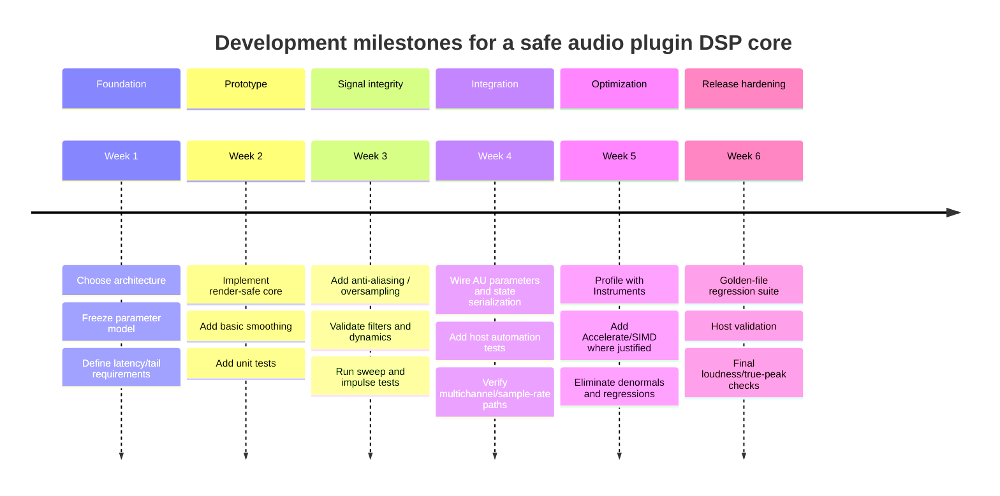

# DSP Testing And Optimization

Use this skill when hardening an audio plugin DSP core for release.

## Test set
- Impulse response tests.
- Sine sweep tests.
- Silence-in/silence-out tests.
- Denormal and subnormal edge tests.
- NaN and Inf state tests.
- Extreme-parameter tests.
- Automation stress tests.
- Offline golden-file regression renders.
- Null tests where applicable.
- Loudness and true-peak checks for dynamics or mastering processors.

## Regression strategy
- Make the DSP core runnable offline before AUv3 integration.
- Keep deterministic test renders for known inputs.
- Use tolerance windows that reflect floating-point realities.
- Include sample-rate variants such as 44.1 kHz, 48 kHz, 96 kHz, and 192 kHz when the algorithm depends on sample rate.
- Include block-size variants, especially tiny and unusually large blocks.
- Include mono, stereo, and any advertised multichannel layouts.
- Add release-candidate tests in real hosts after automated tests pass.

## Profiling workflow
1. Profile before optimizing.
2. Start with CPU and allocation behavior.
3. Confirm the actual hot loop.
4. Flatten memory layouts where it helps cache behavior.
5. Remove unnecessary format conversions.
6. Move slow math out of the render callback.
7. Use Accelerate, vDSP, or SIMD for measured hot spots.
8. Re-run audio regression tests after optimization.

## Optimization guidance
- Use 32-bit floating-point audio paths unless the algorithm needs more.
- Use 64-bit coefficient or design math where it improves stability.
- Keep buffers preallocated.
- Prefer vector math where the data layout and block size justify it.
- Avoid Metal for tight callback work unless the workload is batched enough to amortize GPU latency and transfer cost.
- Treat oversampling as a quality/cost decision that must be measured.

## Numerical checklist
- Clamp externally influenced parameters.
- Reset invalid states immediately.
- Add denormal mitigation for IIR, feedback, and long-tail processors.
- Compute fragile coefficients in higher precision.
- Test silence long enough to expose CPU spikes.
- Test rapid automation for zipper noise and instability.
- Test filter sweeps near Nyquist and high resonance.

## Six-week milestone model

## Done criteria
- The DSP core can be tested offline.
- Render code performs no allocations or locks.
- Automated tests cover impulse, sweep, silence, automation, block size, sample rate, and channel layout cases.
- Dynamics products include loudness and true-peak checks.
- Profiling confirms no avoidable hot-path allocations, conversions, or denormal spikes.
- Final release candidates pass host validation in the claimed DAWs and platforms.
